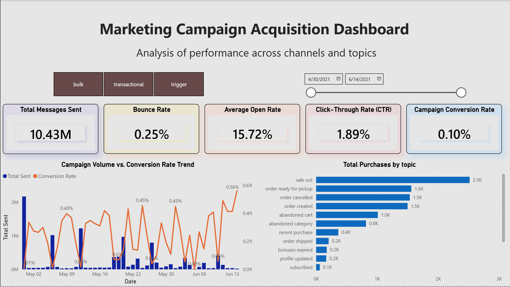
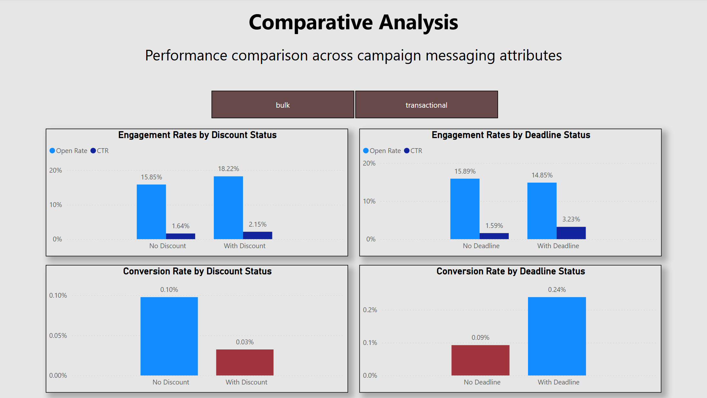
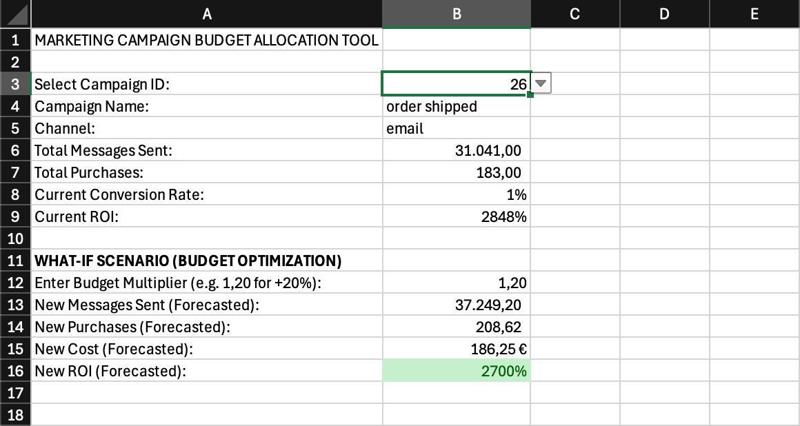
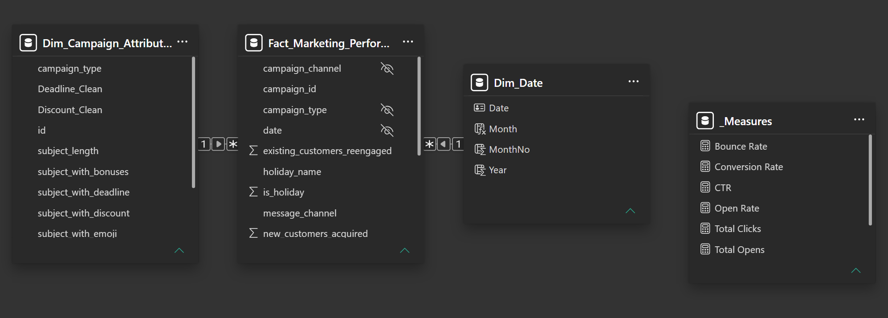

# marketing-campaign-analytics
## Overview

This project analyzes the performance of direct marketing campaigns across Email, SMS, and Push Notification channels using SQL, Power BI, and Excel.

The objective was to evaluate campaign effectiveness, identify the factors that drive engagement and conversions, and build a decision-support tool for marketing budget allocation.

The project combines data preparation, dashboard development, Comparative Analysis, ROI evaluation, and scenario planning.

## Dashboard Preview

Executive Dashboard

Comparative_Analysis_Dashboard

ROI & Budget Optimization Tool

## Business Questions

The project was designed to explore the following business questions:

- Which campaign types drive the strongest engagement and conversion performance?
- Which campaign topics generate the highest number of purchases?
- Do discount-based messages improve customer engagement?
- Does urgency-focused messaging increase click-through and conversion rates?
- How profitable is an individual campaign based on channel-specific costs and revenue assumptions?
- How would campaign ROI change under different budget allocation scenarios?

## Dataset

Source:

[Direct Messaging Dataset (Kaggle)](https://www.kaggle.com/datasets/mkechinov/direct-messaging)

Files used:

- campaigns.csv
- client_first_purchase_date.csv
- holidays.csv
- messages-demo.csv

## Tech Stack
| Tool     | Purpose                                                   |
| -------- | --------------------------------------------------------- |
| MySQL    | Data extraction and KPI aggregation                       |
| Power BI | Data modeling, DAX calculations and dashboard development |
| Excel    | ROI analysis and scenario planning                        |

## Data Model

## Modeling Assumptions

The What-If tool assumes that campaign performance does not scale perfectly as budget increases.

To reflect potential campaign fatigue and diminishing returns, a simple adjustment factor was introduced, gradually reducing conversion efficiency at higher spending levels.

This assumption was included to make ROI projections more realistic and to demonstrate how business considerations can influence analytical models.

## Analytical Outcomes

The project enables:

- Campaign performance analysis across campaign types and topics.
- Evaluation of discount-based and urgency-based messaging strategies.
- Campaign-level profitability analysis using ROI calculations.
- Budget scenario simulation through a What-If forecasting tool.
- Exploration of how campaign fatigue may affect projected ROI.

