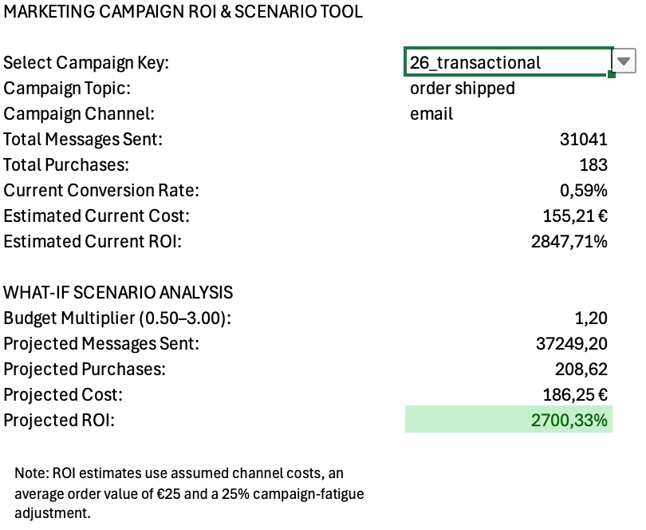
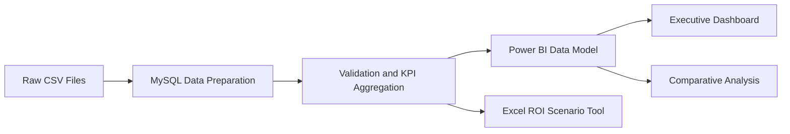

# Marketing Campaign Analytics & ROI Scenario Analysis

## Overview

This end-to-end analytics project transforms **10 million direct-marketing message records** into an interactive campaign-performance and decision-support solution.

The project combines:

* **MySQL** for data loading, cleaning, validation and aggregation.
* **Power BI** for dimensional modeling, DAX measures and interactive reporting.
* **Excel** for campaign-level cost estimation, ROI calculation and What-If scenario analysis.

The final solution supports campaign-performance monitoring, comparison of messaging characteristics and evaluation of campaign-volume scenarios under clearly defined business assumptions.

## Project at a Glance

| Area                          |                                       Result |
| ----------------------------- | -------------------------------------------: |
| Message records processed     |                                   10,000,000 |
| Aggregated campaign-date rows |                                        1,206 |
| Unique campaign keys          |                                           75 |
| Numerical campaign IDs        |                                           73 |
| Message channels analyzed     |         Email, SMS, mobile push and web push |
| Power BI report pages         | Executive Dashboard and Comparative Analysis |
| Decision-support tool         |                      Excel ROI Scenario Tool |

## Business Problem and Decisions Supported

Marketing campaign information was distributed across multiple files containing message activity, campaign characteristics and calendar data.

The objective was to create a consistent analytical solution that could transform these records into reliable performance metrics and support three main decision areas:

* **Performance monitoring:** evaluate campaign volume, engagement, conversion and delivery quality across campaign types, topics and reporting periods.
* **Messaging evaluation:** compare performance patterns between messages with and without discount or deadline attributes.
* **Scenario planning:** estimate campaign cost and ROI and explore how results may change under different campaign-volume assumptions.

The solution is designed to help a marketing or analytics team move from individual message records to structured campaign-level reporting.

## Dashboard Preview

### Executive Dashboard

The Executive Dashboard provides a consolidated overview of:

* Total Messages Sent
* Open Rate
* Click-Through Rate
* Conversion Rate
* Bounce Rate
* Performance trends over time
* Purchases by campaign topic

Users can filter the report by campaign type, topic and reporting period.

<p align="center">
  
</p>

### Comparative Analysis

The Comparative Analysis page evaluates engagement and conversion patterns across:

* Messages with and without discounts
* Messages with and without deadlines

These results represent observational comparisons. They are not presented as controlled A/B-test results or evidence that a messaging attribute directly caused the observed differences.

<p align="center">
  
</p>

### Campaign ROI Scenario Tool

The Excel tool allows the user to select a unique campaign and review:

* Campaign topic and channel
* Total messages sent
* Total purchases
* Current conversion rate
* Estimated current cost
* Estimated current ROI
* Projected messages, purchases, cost and ROI under predefined volume scenarios

<p align="center">
  
</p>

## Key Insights

- **Transactional campaigns showed the highest conversion efficiency**, with an observed conversion rate of **0.65%**, compared with **0.22%** for trigger campaigns and **0.04%** for bulk campaigns.
- **Campaign volume did not translate proportionally into purchases:** bulk campaigns generated **70.6% of all messages** but only **20.2% of purchases**, while transactional campaigns represented **8.0% of messages** and **41.9% of purchases**.
- **The highest observed conversion rates were concentrated among order-related topics**, led by `order cancelled` at **1.07%**, `order ready for pickup` at **0.87%**, `order created` at **0.74%** and `order shipped` at **0.57%**, compared with the overall conversion rate of **0.12%**. The unexpectedly high result for cancellation-related messaging should be investigated further before informing campaign decisions.

These findings are descriptive observations from the available dataset and should not be interpreted as evidence of causation. From a decision-making perspective, campaign evaluation should consider conversion efficiency and purchase contribution alongside message volume.

## End-to-End Workflow



Raw campaign, message and holiday data are loaded and standardized in MySQL. After validating the campaign key and join logic, message-level events are aggregated into a campaign-performance dataset.

The resulting dataset feeds:

* A Power BI model for performance monitoring and comparative analysis
* An Excel tool for campaign-level cost, ROI and What-If scenario calculations

## Tech Stack

| Tool | Key Skills Demonstrated |
|---|---|
| **MySQL** | Data loading, cleaning, joins, validation, indexing and KPI aggregation |
| **Power BI** | Power Query, dimensional modeling, DAX measures and interactive dashboards |
| **Excel** | Structured tables, lookup and aggregation formulas, Data Validation and What-If analysis |

## Power BI Data Model

The Power BI model follows a star-schema-style structure:

* `Fact_Marketing_Performance` contains aggregated campaign results.
* `Dim_Campaign_Attributes` contains descriptive campaign characteristics.
* `Dim_Date` supports date filtering and time-based analysis.
* `_Measures` stores the explicit DAX measures used in the report.

The campaign dimension is connected to the fact table through an active one-to-many relationship using `campaign_key`.

<p align="center">
  
</p>

## Data Modeling and Validation Decisions

### Composite Campaign Key

The numerical campaign ID was not sufficient to uniquely identify every campaign because some IDs were associated with more than one campaign type.

A composite key was therefore created:

```text
campaign_key = campaign_id + "_" + campaign_type
```

Campaign and message records are matched using both:

```text
campaign_id
+
message_type / campaign_type
```

This keeps campaigns with the same numerical ID but different campaign definitions separate throughout SQL, Power BI and Excel.

### Campaign and Message Channels

The source data contains both:

* `campaign_channel`
* `message_channel`

Both fields were retained because the campaign-level channel does not always represent the channel used by every individual message.

The Excel cost calculation uses `message_channel`, allowing email, SMS, mobile-push and web-push costs to be calculated separately within multichannel campaigns.

### Customer Segmentation Limitation

The `client_first_purchase_date.csv` file was reviewed during data validation.

Its available first-purchase dates did not provide suitable temporal alignment with the message period in the demo dataset. Reliable classification of purchases into new and existing customers was therefore not supported.

Customer-acquisition and re-engagement metrics were excluded from the final analytical output.

### Comparative Analysis Scope

The discount and deadline comparisons describe patterns observed in the available data.

Other campaign characteristics may influence performance, so the analysis does not claim that these attributes directly caused the observed differences.

## ROI Scenario Assumptions

The Excel scenario model uses the following assumptions:

| Input                        | Assumption |
| ---------------------------- | ---------: |
| Email cost per message       |     €0.005 |
| Mobile push cost per message |     €0.002 |
| Web push cost per message    |     €0.002 |
| SMS cost per message         |     €0.050 |
| Average order value          |        €25 |
| Campaign-fatigue adjustment  |        25% |

Estimated revenue is calculated as:

```text
Estimated Revenue = Total Purchases × Average Order Value
```

Estimated ROI is calculated as:

```text
Estimated ROI = (Estimated Revenue - Estimated Cost) / Estimated Cost
```

The scenario model assumes that:

* Message volume and cost change proportionally with the selected multiplier.
* Conversion efficiency may decrease as campaign volume increases.
* The fatigue adjustment represents potential diminishing returns.

This is an **assumption-based What-If model**, not a statistically validated forecast, optimization engine or predictive model.

## Dataset

Source: [Direct Messaging Dataset — Kaggle](https://www.kaggle.com/datasets/mkechinov/direct-messaging)

Files reviewed during the project:

* `campaigns.csv`
* `messages-demo.csv`
* `holidays.csv`
* `client_first_purchase_date.csv`

The final analytical output uses campaign, message and holiday information.

The first-purchase file was reviewed as part of the data-quality assessment but was not used for customer segmentation in the final model.

## Project Deliverables

| Deliverable                          | File                                                                                                   |
| ------------------------------------ | ------------------------------------------------------------------------------------------------------ |
| SQL data preparation and aggregation | [Marketing_Performance_Aggregation.sql](sql/Marketing_Performance_Aggregation.sql)                     |
| Power BI report and data model       | [Marketing_Campaign_Performance_Dashboard.pbix](powerbi/Marketing_Campaign_Performance_Dashboard.pbix) |
| Excel ROI scenario tool              | [Marketing_Campaign_ROI_Scenario_Tool.xlsx](excel/Marketing_Campaign_ROI_Scenario_Tool.xlsx)           |


